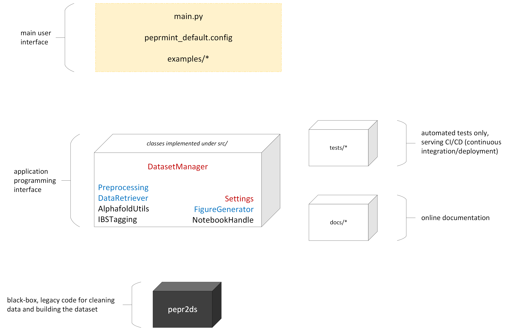

# Different user, different needs

A researcher interested in just using the software without modifying or making extensions to the source code should pay attention to two files only:

1. `peprmint_default.config`
The options here are intuitive and should reflect the desired computation

2. either `main.py` (if one wants to run the execution from a terminal) or `main-nb-example.ipynb` (if one prefers to run within a jupyter notebook)
The uncommented lines here (_i.e._ those not starting with a # character) trigger the different steps of the execution. See the description of the API below for details.

Look also the contents of the `Examples` directory for some usage examples and side applications contributed by different users. By the way: did you draw some nice observation using the software, or just did something cool? **Consider adding your code as an example as well!** Just create a new branch, copy your main script and .config file into `Examples`, and make a pull request. Get in touch if you need help with that!

If you're a programmer interested in making changes to the source code to suit a particular project needs, it is worth understanding the architecture a bit better.
The different classes and their interfaces are described below under API. **We are currently preparing a more thorough documentation**.

# The dataset

The central data structure used throughout this project is a pandas DataFrame containing the following information in each column.

| Column                      | Meaning                                                       | Notes                                                                                |
| --------------------------- | ------------------------------------------------------------- | ----------------------------------------------------------------------------------------------- |
| domain                      | domain name                                                   | \-                                                                                              |
| cathpdb                     | CATH ID                                                       | \-                                                                                              |
| pdb                         | PDB ID                                                        | \-                                                                                              |
| uniprot\_acc                | Uniprot accession number                                      | _e.g._ Q9ULH1                                                                                   |
| uniprot\_id                 | Uniprot ID                                                    | _e.g._ ASAP1\_HUMAN)                                                                            |
| residue\_name               | residue name                                                  | \-                                                                                              |
| IBS                         | interfacial binding sites?                                    | True if residue is part of the IBS, False otherwise                                             |
| chain\_id                   | chain name                                                    | PDB chain ID                                                                                    |
| residue\_number             | residue ID/number                                             | \-                                                                                              |
| b\_factor                   | B-factor of each atom                                         | \-                                                                                              |
| sec\_struc                  | Secondary structure                                           | simplified description                                                                          |
| sec\_struc\_full            | Secondary structure                                           | detailed description                                                                            |
| prot\_block                 | Protein Block                                                 | see [https://github.com/pierrepo/PBxplore](https://github.com/pierrepo/PBxplore) for more info. |
| data\_type                  | source database                                               | whether entry is experimental (cathpdb) or from a model (alphafold)                             |
| Experimental Method         | experiment method for obtaining the structure                 | \-                                                                                              |
| resolution                  | strcuture resolution                                          | 999 if the structure is NMR                                                                     |
| RSA\_total\_freesasa\_tien  | Exposition calculated by the definition of Tien _et al_ 2013  | \-                                                                                              |
| convhull\_vertex            | convex hull flag                                              | residue is part of the convex hull                                                              |
| protrusion                  | protrusion flag                                               | residue is a protrusion                                                                         |
| is\_hydrophobic\_protrusion | hydrophobic protrusion flag                                   | residue is a hydrophobic protrusion                                                             |
| is\_co\_insertable          | co-insertable flag                                            | residue is a co-insertable                                                                      |
| neighboursList              | neighbour residue number list                                 | neighbours list of residue (if it is in the convex hull)                                        |
| density                     | protein density                                               | number of CA/CB in a radius of 1nm                                                              |
| exposed                     | exposition flag                                               | if residue is exposed (RSA >20%) or not (RSA <= 20%)                                            |
| S35                         | Cath cluster number at 35% of identity                        | Cath cluster id. at 35% of seq id.                                                              |
| S60                         | Cath cluster number at 60% of identity                        | Cath cluster id. at 60% of seq id.                                                              |
| S95                         | Cath cluster number at 95% of identity                        | Cath cluster id. at 95% of seq id.                                                              |
| S100                        | Cath cluster number at 100% of identity                       | Cath cluster id. at 100% of seq id.                                                             |
| uniref50                    | Representative uniprot\_acc for cluster with 50% of identity  | representative sequence for protein sequence at 50% of seq id.                                  |
| uniref90                    | Representative uniprot\_acc for cluster with 90% of identity  | representative sequence for protein sequence at 90% of seq id.                                  |
| uniref100                   | Representative uniprot\_acc for cluster with 100% of identity | representative sequence for protein sequence at 100% of seq id.                                 |
| origin                      | Specie of origin                                              | origin of the protein (_e.g._ HUMAN, MOUSE...)                                                  |
| location                    | Location of the protein in the cell                           | \-                                                                                              |
| taxon                       | Taxonomy of the protein                                       | taxonomy at level 0 and 1 of the protein (eucaryote/procaryote etc..)                           |

# The API

The organization of this project's repository is illustrated below.

The `DatasetManager` class is the main data structure used throughout most tasks. It depends on an instance of `Settings`, which parses the .config file and allows fine tuning additional superfamilies to use as input, _etc_.

Through public methods of DatasetManager, we also trigger functionalities from its `AlphafoldUtils` and `IBSTagging` attributes, which take the intuitive responsibilities suggested by the class names.

Important auxiliary features are offered by methods in the `Preprocessing`, `DataRetriever`, and `FigureGenerator` classes. Preprocessing consists essentially of superimposition and rearranging protein structures in space. DataRetriever handles fetching raw data files from databases such as CATH and Prosite. FigureGenerator is only used when all computation is done, and offers several plot options to study properties of the interfacial binding sites (IBS) of entries in the computed dataset.

** TO DO: **
- Add all classes interfaces with a short description
- Add examples stopping at different stages of the process
